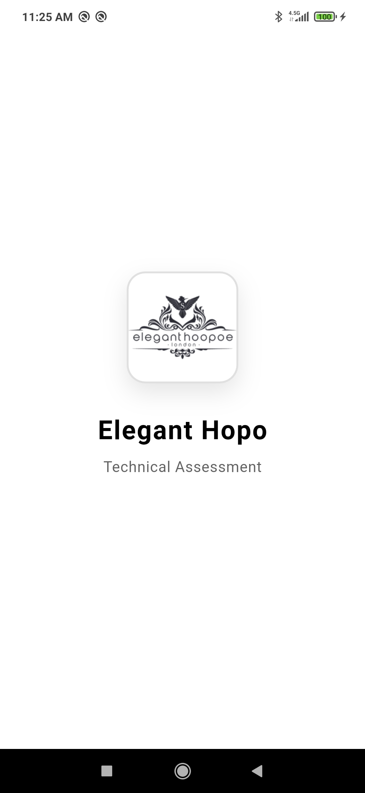
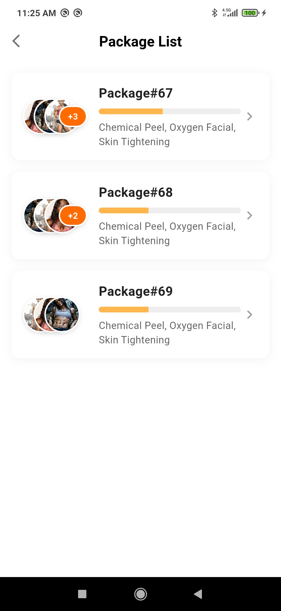
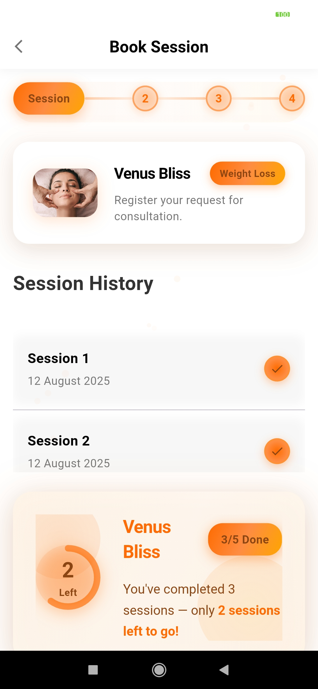
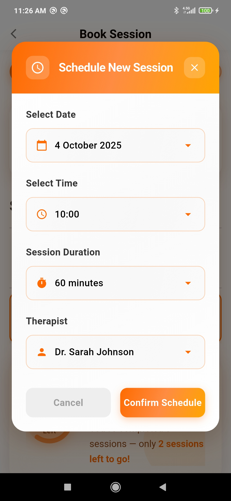

# Elegant Hopo Technical Assessment

A Flutter application designed for beauty package booking and session management, built as a technical assessment showcasing modern Flutter development practices with clean architecture principles.

## 📱 App Demo

<div align="center">
  <h3>🎬 App Animation</h3>
  
</div>

<br>

<div align="center">
  <h3>📸 App Screenshots</h3>
  <table>
    <tr>
      <td align="center" width="25%">
        <h4>📱 Splash Screen</h4>
        
      </td>
      <td align="center" width="25%">
        <h4>📦 Package List</h4>
        
      </td>
      <td align="center" width="25%">
        <h4>📅 Session Booking</h4>
        
      </td>
      <td align="center" width="25%">
        <h4>🎯 Session Details</h4>
        
      </td>
    </tr>
  </table>
</div>

## 🚀 Features

### Core Functionality
- **🎨 Splash Screen**: Animated welcome screen with elegant branding
- **📦 Package Management**: Browse and view beauty treatment packages with progress tracking
- **📅 Session Booking**: Interactive session scheduling with date/time selection
- **👥 User Management**: Complete user authentication and profile management system
- **🔄 Real-time Updates**: Live data synchronization and state management

### Beauty Package Features
- **Package Discovery**: View available beauty treatment packages (Chemical Peel, Oxygen Facial, Skin Tightening)
- **Progress Tracking**: Visual progress indicators for package completion
- **Image Galleries**: Multiple treatment images with overlay indicators
- **Package Details**: Comprehensive package information and service descriptions

### Session Management
- **Multi-Session Support**: Manage multiple treatment sessions per package
- **Interactive Scheduling**: Date picker and time selection for booking
- **Session History**: View completed and upcoming sessions
- **Therapist Assignment**: Select preferred therapists for sessions
- **Duration Selection**: Choose session duration (60 minutes default)

### User Experience
- **Smooth Animations**: Flutter Animate and Staggered Animations for enhanced UX
- **Responsive Design**: Adaptive layouts for different screen sizes
- **Dark/Light Theme**: System-based theme switching with Material 3 design
- **Error Handling**: Comprehensive error states and retry mechanisms
- **Loading States**: Beautiful loading indicators and skeleton screens

## 🏗️ Architecture

This application follows **Clean Architecture** principles, implementing a modular and scalable structure:

### Core Architecture Layers

#### 1. **Presentation Layer**
- **BLoC Pattern**: State management using `flutter_bloc`
- **Reactive UI**: Event-driven user interface updates
- **Widget Composition**: Reusable and maintainable UI components
- **Navigation**: Declarative routing with `go_router`

#### 2. **Domain Layer**
- **Entities**: Core business objects (`User`, `BeautyPackage`, `Credentials`)
- **Use Cases**: Business logic encapsulation
- **Repositories**: Abstract data access contracts
- **Value Objects**: Immutable data structures

#### 3. **Data Layer**
- **Repository Implementation**: Concrete data access logic
- **Data Sources**: Local and remote data providers
- **Models**: JSON serialization with `freezed` and `json_annotation`
- **Network**: HTTP client with error handling

### Feature Modules

Each feature is self-contained with its own:
- **Presentation**: Pages, widgets, and BLoCs
- **Domain**: Entities, use cases, and repository interfaces
- **Data**: Models, data sources, and repository implementations

```
lib/
├── core/                    # Shared utilities and infrastructure
│   ├── di/                 # Dependency injection setup
│   ├── error/              # Error handling and failures
│   ├── network/            # Network client and connectivity
│   ├── routing/            # App routing configuration
│   ├── utils/              # Constants and utilities
│   └── widgets/            # Shared UI components
├── features/
│   ├── auth/               # Authentication feature
│   ├── packages/           # Beauty package management
│   ├── splash/             # App splash screen
│   └── user/               # User management
└── main.dart               # App entry point
```

## 🛠️ Technical Stack

### State Management
- **[flutter_bloc](https://pub.dev/packages/flutter_bloc)** - Predictable state management
- **[equatable](https://pub.dev/packages/equatable)** - Value equality for states and events

### Dependency Injection
- **[get_it](https://pub.dev/packages/get_it)** - Service locator pattern
- **[injectable](https://pub.dev/packages/injectable)** - Code generation for DI

### Networking & Data
- **[http](https://pub.dev/packages/http)** - HTTP client for API calls
- **[connectivity_plus](https://pub.dev/packages/connectivity_plus)** - Network connectivity monitoring
- **[shared_preferences](https://pub.dev/packages/shared_preferences)** - Local data persistence

### Code Generation
- **[freezed](https://pub.dev/packages/freezed)** - Immutable classes and unions
- **[json_annotation](https://pub.dev/packages/json_annotation)** - JSON serialization
- **[build_runner](https://pub.dev/packages/build_runner)** - Code generation runner

### UI & Navigation
- **[go_router](https://pub.dev/packages/go_router)** - Declarative routing
- **[google_fonts](https://pub.dev/packages/google_fonts)** - Custom typography
- **[flutter_animate](https://pub.dev/packages/flutter_animate)** - Smooth animations
- **[flutter_staggered_animations](https://pub.dev/packages/flutter_staggered_animations)** - List animations
- **[cached_network_image](https://pub.dev/packages/cached_network_image)** - Image caching

### Functional Programming
- **[dartz](https://pub.dev/packages/dartz)** - Functional programming utilities

### Development Tools
- **[logger](https://pub.dev/packages/logger)** - Structured logging
- **[very_good_analysis](https://pub.dev/packages/very_good_analysis)** - Linting rules
- **[mocktail](https://pub.dev/packages/mocktail)** - Testing utilities

## 🚀 Getting Started

### Prerequisites
- Flutter SDK (>=3.8.0)
- Dart SDK (>=3.0.0)
- Android Studio / VS Code
- Git

### Installation

1. **Clone the Repository**
   ```bash
   git clone https://github.com/yourusername/elegant_hopo_technical_assessment.git
   cd elegant_hopo_technical_assessment
   ```

2. **Install Dependencies**
   ```bash
   flutter pub get
   ```

3. **Generate Code**
   ```bash
   flutter packages pub run build_runner build
   ```

4. **Run the Application**
   ```bash
   # For development
   flutter run

   # For specific platform
   flutter run -d android
   flutter run -d ios
   flutter run -d web
   ```

### Building for Production

```bash
# Android APK
flutter build apk --release

# Android App Bundle
flutter build appbundle --release

# iOS
flutter build ios --release

# Web
flutter build web --release
```

## 🧪 Testing

```bash
# Run unit tests
flutter test

# Run integration tests
flutter test integration_test/

# Run tests with coverage
flutter test --coverage
```

## 📱 Screenshots

The app includes:
- **Splash Screen**: Elegant animated welcome with logo
- **Package List**: Beautiful cards showing treatment packages with progress
- **Session Booking**: Interactive calendar and time selection interface
- **User Management**: Complete authentication and profile screens

## 🔧 Configuration

### Environment Setup
- Configure API endpoints in `lib/core/network/network_client.dart`
- Update app configuration in `lib/main.dart`
- Customize themes in the MaterialApp configuration

### Assets
- Logo: `assets/images/elegant-logo-dark.png`
- Treatment images: `assets/images/images_01.jpg`, `images_02.jpg`, `images_03.jpg`

## 🤝 Contributing

1. Fork the repository
2. Create a feature branch (`git checkout -b feature/amazing-feature`)
3. Commit your changes (`git commit -m 'Add amazing feature'`)
4. Push to the branch (`git push origin feature/amazing-feature`)
5. Open a Pull Request

## 📄 License

This project is part of a technical assessment and is not intended for commercial use.

## 🙏 Acknowledgments

- Flutter community for excellent packages and documentation
- Material Design 3 for beautiful UI components

---

**Built with ❤️ using Flutter and Clean Architecture principles**